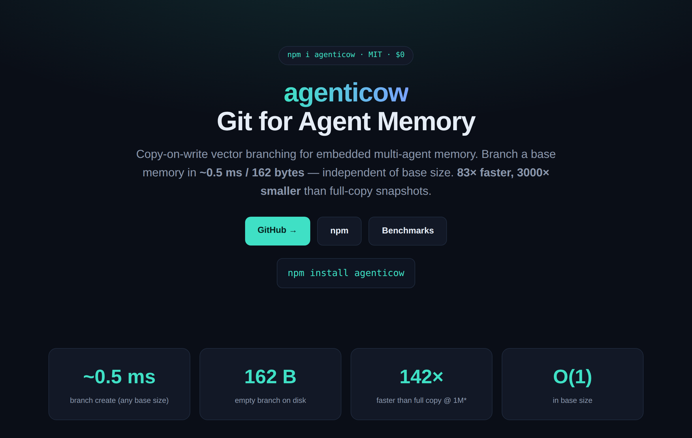
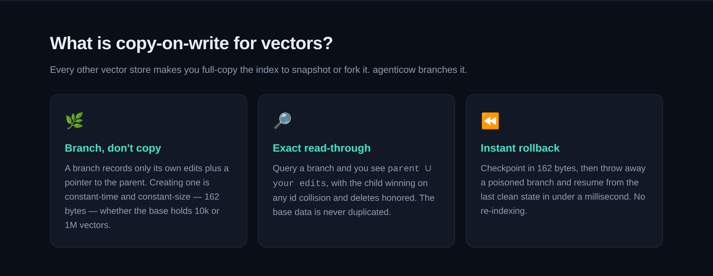
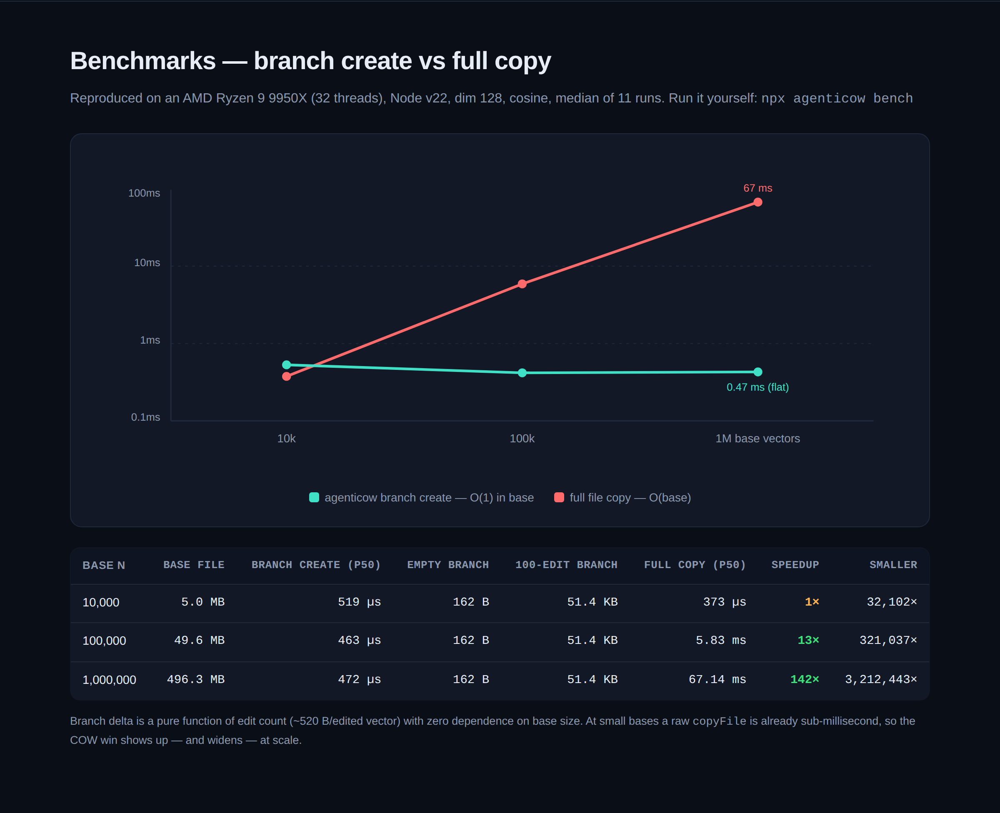
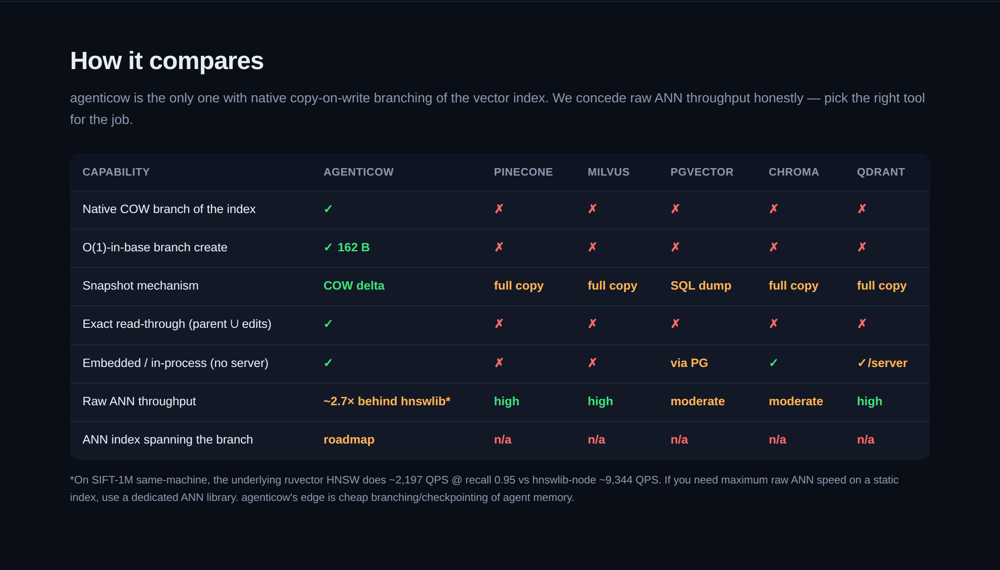
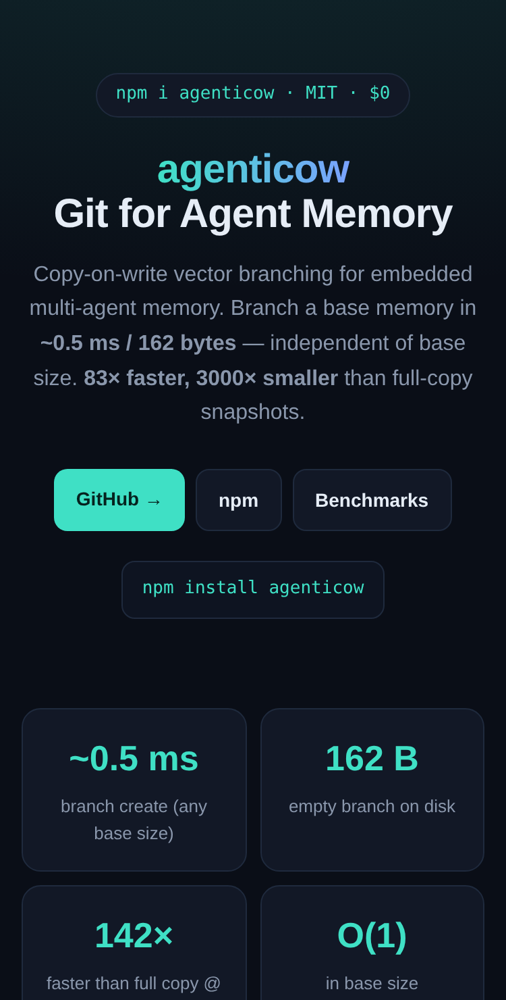

<div align="center">

# agenticow — Git for Agent Memory: Copy-On-Write vector branching (83× faster, 3000× smaller snapshots)

**Branch a base vector memory in ~0.5 ms / 162 bytes — independent of base size.** Exact read-through queries (parent ∪ edits, child wins). Built for embedded multi-agent memory.

[](https://www.npmjs.com/package/agenticow)
[](./LICENSE)
[](./test)
[](#acceptance-the-1000-branch-proof)

**[Website / Demo →](https://ruvnet.github.io/agenticow/)** · **[npm](https://www.npmjs.com/package/agenticow)** · **[Benchmarks](#benchmarks)** · **[Acceptance proof](#acceptance-the-1000-branch-proof)**



</div>

> **agenticow turns memory from a static database into a branchable runtime primitive for agents.**

Every other vector store makes you **full-copy** the index to snapshot, fork, or checkpoint it. `agenticow` **branches** it — copy-on-write, like Git. Creating a branch costs ~0.5 ms and 162 bytes whether the base holds 10,000 or 1,000,000 vectors. Query a branch and you transparently see `parent ∪ your edits`, with the child winning on id collisions and deletes honored.

```bash
npm install agenticow
```

---

## Why

Agents need memory that branches: a per-user personalization layer, a sandbox to test a risky ingest, a checkpoint before a tool call, a thousand parallel experiments off one shared base. With a normal vector DB each of those is a **full copy** of the whole index. At 1M vectors that is **496 MB and 67 ms** — every time. agenticow makes it **162 bytes and 0.47 ms**, flat.

### Three things it makes cheap

| Use case | What it replaces | Cost with agenticow |
|---|---|---|
| 👥 **Parallel agents share one base memory** | N full copies of the index | N × 162 B, N × 0.5 ms |
| 🧪 **Roll back a poisoned / hallucinated branch** | re-ingest + re-index from backup | drop the branch, ~0.5 ms |
| 📌 **Zero-cost checkpointing before risky steps** | periodic full snapshots | 162 B + edits-since per checkpoint |

---

## Quick start

```js
import { open } from 'agenticow';

// open or create a base memory
const base = open('memory.rvf', { dimension: 1536 });
base.ingest([{ id: 1, vector: embedding }, /* ... */]);

// branch it for a parallel agent — ~0.5 ms / 162 B, any base size
const agent = base.branch('agent-a');
agent.ingest([{ id: 9001, vector: newMemory }]);     // isolated from the base

// exact read-through: sees base + its own edits, child wins on id collision
const hits = agent.query(queryVector, 10);
// -> [{ id, distance, branch }, ...]  (tombstone-masked, reranked)

// NEW in 0.2.0 — native ANN ACROSS the branch (single Rust dual-graph query):
const fast = base.fork('agent-b', null, { nativeAnn: true });
fast.ingest([{ id: 9002, vector: newMemory }]);
fast.query(queryVector, 10);    // parent ∪ edits via native HNSW, recall@10 ≈ 1.0
fast.nativeAnn;                  // true on linux-x64; false (exact fallback) elsewhere

// checkpoint + roll back a poisoned branch
const ckpt = agent.checkpoint('clean');
agent.ingest([{ id: 666, vector: poison }]);
agent.rollback(ckpt.id);                              // poison gone, clean memory intact
```

### CLI

```bash
agenticow init   mem.rvf --dim 128
agenticow ingest mem.rvf --n 5000
agenticow branch mem.rvf --as user-42        # cheap per-user personalization
agenticow query  mem.rvf.user-42.rvf --k 10  # top-K read-through (masked, reranked)
agenticow diff   mem.rvf.user-42.rvf         # added / overridden / tombstoned ids
agenticow demo                               # scripted end-to-end walkthrough
agenticow bench                              # branch-create benchmark
agenticow acceptance                         # the 1,000-branch proof
```

| Verb | Use case |
|---|---|
| `branch` | per-user / per-repo / per-account personalization off one shared base — *personalization without memory explosion* |
| `checkpoint` / `rollback` | per-task checkpointing; quarantine a bad/hallucinated ingest and instantly revert |
| `diff` / `promote` | Git-style memory workflow: agent branch → test → reviewed → production |
| `query` | top-K read-through with tombstone masking + exact rerank |
| `fork` (API) | fan out many branches off a static base (1,000 per-user branches in one process) |

A worked script lives in [`examples/parallel-agents.mjs`](./examples/parallel-agents.mjs): fork N branches from a base, ingest + tombstone per branch, query each, roll one back.

---

## Applications

Concrete ways to use COW agent memory — each with a runnable script in
[`examples/`](./examples). Framing is honest: **practical** = PROVEN (bench +
acceptance), **platform** = DEMONSTRATED + benchmarked, **exotic** = PoC mechanics
(cognition out of scope). See the [claim ladder](#claim-ladder).

### 🏭 Flagship production patterns *(runnable + executed)*

Four end-to-end production use cases, all following one paradigm —
**Branch → Mutate → external-Verify → Promote / Discard**. Selection is **always**
a deterministic **external** verifier (test / regex / checker / distance
function), **never a cheap LM-as-judge** — the scaffolding ablation showed a
verifier-gated cheap-LM judge picks *worse* than a plain vote (a negative
generation–verification gap), so the gate must be something that can't
hallucinate. These demonstrate the branching **mechanics** (production-ready
patterns), not model intelligence. Run all four: `npm run examples:production`.

**Implement right now** (this snippet runs verbatim against the published API —
`openBase`, `ingest(vec,{text})`, `query(vec,{topK})`, `promote()`, `rollback()`):

```js
import { openBase } from 'agenticow';

const base = openBase('kb.rvf', { dimension: 1536 });

// Branch → Mutate: an untrusted batch lands in an isolated fork, never the base.
const sandbox = base.fork('untrusted-doc');
sandbox.ingest(docEmbedding, { text: 'untrusted document' });

// external-Verify: a deterministic checker (NOT an LM-judge) gates the branch.
const hits = sandbox.query(injectionSignature, { topK: 3 });
const exploit = hits.some((h) => h.distance < 0.02);   // distance threshold = the oracle

// Promote / Discard:
if (exploit) sandbox.rollback();   // discard — base never saw it (blast radius 0)
else         sandbox.promote();    // merge the vetted delta into the base
```

| Use case | External verifier (deterministic) | Measured result |
|---|---|---|
| 🛡️ [`red-team-sandbox.mjs`](./examples/red-team-sandbox.mjs) — untrusted-doc ingestion | injection-signature distance probe | exploit→`rollback()` **1.1 ms**, **0** vectors reached base; clean→`promote()` |
| 🗳️ [`multi-persona-consensus.mjs`](./examples/multi-persona-consensus.mjs) — 5 personas, 1 winner | policy-constraint gate **+** distance-to-rubric score | **4/5** qualified, winner promoted, losers discarded free |
| ⏪ [`time-travel-debug.mjs`](./examples/time-travel-debug.mjs) — rewind past a latent bug | compiler-style bad-signature scan | rewind to step-10 ckpt **1.1 ms**, **0** steps replayed, 24/24 reachable |
| 🏢 [`multi-tenant-saas.mjs`](./examples/multi-tenant-saas.mjs) — 1,000 tenant branches | cross-tenant isolation oracle (200 probes) | **0/200** leaks, **2.4 KB**/tenant, **530×** less disk than full copies |

→ outputs + details in [`examples/README.md`](./examples/README.md#-flagship-production-patterns).

### 🟢 Personalization — one base, a branch per user *(practical)*
Give every user/account/tenant their own memory branch off a shared base. Private
edits stay isolated; storage is delta-only (KB/user, not a full copy).
```js
const base = open('kb.rvf', { dimension: 1536 });
const userMem = base.fork(`user-${userId}`);
userMem.ingest([{ id, vector }]);          // private to this user
userMem.query(q, 10);                       // reads through to the shared base
```
→ [`examples/personalization.mjs`](./examples/personalization.mjs) · [`parallel-agents.mjs`](./examples/parallel-agents.mjs)

### 🟢 Rollback / quarantine — discard a poisoned branch *(practical)*
An agent ingests hallucinated or adversarial memories into a sandbox branch.
Detect it, drop the branch — the base is instantly clean, no re-index.
```js
const sandbox = base.fork('untrusted');
sandbox.ingest(unvettedVectors);
// ...detect bad content...
sandbox.close();                            // discard → base never saw it
```
→ [`examples/rollback-quarantine.mjs`](./examples/rollback-quarantine.mjs)

### 🟢 Checkpointing — crash recovery without replay *(practical)*
Checkpoint memory before each risky step (162 B each). On failure, roll back to
the last good checkpoint in ~0.5 ms — earlier steps are not replayed.
```js
const ck = mem.checkpoint('step-30');
// ...step 31 crashes...
mem.rollback(ck.id);                         // resume from step 30
```
→ [`examples/checkpointing.mjs`](./examples/checkpointing.mjs)

### 🟢 Git-style memory workflow — branch → diff → promote *(practical)*
Treat memory like code: branch a feature, review the change with `diff()`, and
`promote()` the vetted delta into production.
```js
const feature = prod.branch('feature');
feature.ingest(newFacts);
feature.diff();                              // { added, overridden, deleted }
feature.promote(prod);                       // merge into production
```
→ [`examples/git-workflow.mjs`](./examples/git-workflow.mjs)

### 🟢 Promotion pipeline — agent → sandbox → review → prod *(platform — DEMONSTRATED)*
A "memory DevOps" pipeline: an agent proposes memories in a sandbox branch, a
review gate scores them, and only a passing branch is promoted. A rejected branch
is discarded and never reaches base — with a lineage audit (parent/label/timestamp)
at each step.
→ [`examples/promotion-pipeline.mjs`](./examples/promotion-pipeline.mjs)

### 🟢 A/B testing at scale — score variants, promote the winner *(platform — DEMONSTRATED)*
Fork N variant branches off one base, score each, and promote only the winner.
Benchmarked at 128 variants (fork 1.3 ms/variant, score 0.15 ms/variant, 0.84 KB/variant).
```js
const variants = ids.map((i) => base.fork(`variant-${i}`));
// ...score each...
variants[best].promote(base);               // keep the winner, drop the rest free
```
→ [`examples/ab-branches.mjs`](./examples/ab-branches.mjs) · [`ab-at-scale.mjs`](./examples/ab-at-scale.mjs)

### 🟢 Compliance, lineage & right-to-erasure *(platform — DEMONSTRATED)*
`lineage()` gives an auditable parent/label/timestamp trail for every mutation
("why does the agent know X?"). Per-user data lives in its own branch layer, so
dropping that layer surgically erases exactly that user's data (GDPR-style).
→ [`examples/compliance-lineage.mjs`](./examples/compliance-lineage.mjs)

### 🟡 Edge / local-first agents — embedded, no server *(strategic)*
agenticow runs in-process over a single `.rvf` file — no DB server, no network.
Thousands of cheap branches fit on-device for offline/edge multi-agent memory.

### ⚗️ Cognitive ensembles, evolution & simulated orgs *(exotic — PoC mechanics)*
PoCs that demonstrate the branching **mechanics** of advanced patterns — NOT that
the branches are intelligent (the judge/fitness is a scoring function, cognition
is out of scope):
- **Parallel selves** — an ensemble of personas off one base, a judge picks + promotes the winner → [`examples/parallel-selves.mjs`](./examples/parallel-selves.mjs)
- **Darwin-on-memory** — a population evolves over generations; storage stays delta-sized → [`examples/memory-evolution.mjs`](./examples/memory-evolution.mjs)
- **Simulated org** — departmental branches with cross-branch contradiction detection before rollout → [`examples/simulated-org.mjs`](./examples/simulated-org.mjs)

### 🔭 Agent marketplaces & shared base memories *(exotic — vision, not shipped)*
A published base memory that many agents branch from, contributing deltas back —
a "memory package registry". The branch/promote primitives exist today; the
distribution, trust, and merge-policy layer is **roadmap, not shipped**.

---

## MetaHarness usage

agenticow is the **memory plane** of the [`@metaharness/*`](https://www.npmjs.com/org/metaharness)
agent-harness ecosystem. It pairs with [`@metaharness/jujutsu`](https://www.npmjs.com/package/@metaharness/jujutsu)
(`v0.1.0`), which wraps [`agentic-jujutsu`](https://www.npmjs.com/package/agentic-jujutsu)
(a Rust+NAPI Jujutsu `jj` op-log with QuantumDAG coordination, ReasoningBank
trajectories, and ML-DSA signing) — the **code/op plane**.

**The dual-state bridge (ADR-202).** A coding agent that explores must branch and
roll back *two* planes: the **code/ops** it did and the **memory** it learned.
Used separately they drift (revert code but keep poisoned memory; promote a
memory delta whose ops were never merged). `@metaharness/jujutsu`'s
`DualStateBridge` ties them 1:1 — one agent ⇒ one op branch + one memory branch —
mapping four lifecycle verbs onto agenticow:

| Verb | code/op plane (agentic-jujutsu) | memory plane (agenticow) |
|---|---|---|
| **spawn** | `jj bookmark create` + start trajectory | `fork()` off the base + `checkpoint('spawn')` |
| **learn** | finalize trajectory + read op-sequence | embed ops → `ingest()` into the branch |
| **revert** | `jj undo` | `rollback()` to the spawn checkpoint |
| **merge** | `jj squash` ops into base | `promote()` the winning delta into the base |

Install alongside (both planes are **optional peer deps** — the bridge runs
degraded/mock-backed if one is absent, per the ADR-150 *removable-augmentation*
principle):

```bash
npm install @metaharness/jujutsu agenticow agentic-jujutsu
```

```js
import { open } from 'agenticow';
// @metaharness/jujutsu wires these two planes behind DualStateBridge:
const base = open('reasoning-bank.rvf', { dimension: 1536 });
const agentMem = base.fork('agent-007');     // memory branch (spawn)
agentMem.checkpoint('spawn');
agentMem.ingest(embeddedTrajectory);          // learn
// if the trajectory scores poorly:
agentMem.rollback(/* spawn checkpoint id */); // revert — code revert via `jj undo`
// if it wins:
agentMem.promote(base);                        // merge — ops via `jj squash`
```

**Honest status (ADR-202):** spawn / learn / revert / merge are **wired
end-to-end** with both real native planes. **Cross-branch ANN query is now
shipped** — agenticow `0.2.x` adds native dual-graph ANN across the COW boundary
(`fork({ nativeAnn: true })`, [RuVector PR #617/#618](https://github.com/ruvnet/RuVector/pull/617),
recall@10 ≈ 1.0 on linux-x64; exact read-through fallback elsewhere). The bridge
adapter can swap from the exact-read-through port to the native ANN port with no
interface change.

---

## Deployment patterns (what the data says)

**Thesis: smarter *orchestration*, not smarter *execution*.** When you run cheap
models at scale, the lever is *how you spawn, branch, select, and roll back* — not
squeezing more "intelligence" out of any single run. This isn't a slogan: it's what
a head-to-head scaffolding ablation on FRAMES (cheap models `deepseek-v4-pro` +
`glm-5.2`, n=50, strict EM, Wilson CIs, reasoning OFF) actually measured. Every
pattern below cites that finding. Full study + reproduce script:
[`SCAFFOLDING-ABLATION.md`](https://github.com/ruvnet/agent-harness-generator/blob/main/docs/research/scaffolding/SCAFFOLDING-ABLATION.md).

### 1. Fail-fast, shallow branches — not deep self-refine loops

The ablation showed that *adding reasoning machinery to a cheap model backfires*:
**Plan-and-Solve −10pp** (deepseek 0.50→0.40) / **−6pp** (glm 0.42→0.36),
**Reflexion −8pp at 2.85× cost** (8.2→21.4 steps, "cost without lift"), and the
**PS+BoN compound stacks the damage** (deepseek vote 0.48 < plain-BoN 0.56). The
base ReAct loop already **saturates around 8–12 steps** — a turn-budget cliff where
more steps stop discovering and just give error-compounding more surface area.

**So:** run **2–3-turn tasks**. On failure, don't force the cheap model to
self-correct — **drop the branch (~0.5 ms rollback) and respawn** with a shifted
prompt / clean state. agenticow makes failure *free*, so "throw it away and try a
fresh independent attempt" beats "make it reflect on its mistake."

### 2. Scale horizontally — massively parallel personalization

Cheap models are at their best on the **first shot**; the ablation found no
reasoning scaffold buys a cost-justified lift, and the *only* directional gain
(Self-Consistency, +4–6pp) **saturates by N≈7** and costs ~10× — i.e. the win is in
*more independent attempts*, not deeper ones. The product win is therefore
**multi-tenant scale**: agenticow runs **1,000 isolated branches at 943× less disk**
than 1,000 full copies (10.5 MB vs 9.69 GB; see [acceptance](#acceptance-the-1000-branch-proof)).
**Many shallow agents off one base, not one deep agent.**

### 3. Selection must be EXTERNAL + deterministic — never the cheap LM as judge

The ablation's cleanest negative result: a **verifier-gated LM-judge picks *worse*
than a plain majority vote off the same samples** (deepseek **−4pp**, glm **−6pp**) —
a *negative* generation-verification gap. A cheap model judging its own outputs,
with no oracle, is a worse selector than counting votes.

**So for promotion / merge (`diff` → `promote`), score branches with an EXTERNAL,
deterministic signal:** unit tests, compilers, regex / schema validators, a
human-gate — **not** the cheap model. The branch primitive gives you the isolation;
the *gate* must be something that can't hallucinate.

**The nuance — an execution oracle flips this.** That backfire was on FRAMES, which
has *no* ground-truth verifier. On **code**, tests are a **zero-cost, near-perfect
verifier** — so promotion-by-test-verification *is* strong there (the ablation
explicitly flags SWE-bench-style execution as the case where the verifier gap goes
positive). This is exactly the bridge to
[`@metaharness/jujutsu`](#metaharness-usage): **code branches gated by tests**, where
the gate is an execution oracle, not a model.

### 4. Positioning — Infrastructure/DevOps layer, not a cognitive enhancer

agenticow is **Git for agent memory**, not a way to make agents *smarter*. Git
doesn't make developers write better code — it lets thousands of them work
concurrently, isolate mistakes, roll back, and merge through CI. agenticow is the
same shape for cheap-model fleets: it makes running them at scale **governed,
isolated, auditable, and ~computationally free** (162 B / 0.5 ms branch; instant
rollback; lineage for right-to-erasure). It does **not** make the models smarter —
and the data says nothing at the orchestration layer reliably does: RAG was null and
*every* reasoning scaffold backfired or failed to pay for itself on cheap models.
**The honest claim is leverage, not intelligence:** infrastructure that turns "run
1,000 cheap agents safely" into a tractable, near-free operation.

---

## How copy-on-write for vectors works



A branch records **only its own edits** plus a pointer to its parent. Creating one is constant-time and constant-size — **162 bytes** — independent of base size. A query walks the lineage chain (`child → … → base`), merges each store's results, lets the **child win** on any id collision, masks anything the branch **tombstoned**, and re-ranks by exact distance.

---

## Benchmarks

Reproduced on an **AMD Ryzen 9 9950X** (32 threads), Node v22, dim 128, cosine, median of 11 runs. Run it yourself: `npx agenticow bench`.



| Base N | Base file | Branch create (p50) | Empty branch | 100-edit branch | Full copy (p50) | Speedup | Smaller |
|-------:|----------:|--------------------:|-------------:|----------------:|----------------:|--------:|--------:|
| 10,000 | 5.0 MB | 519 µs | **162 B** | 51.4 KB | 373 µs | 1× | 32,102× |
| 100,000 | 49.6 MB | 463 µs | **162 B** | 51.4 KB | 5.83 ms | 13× | 321,037× |
| 1,000,000 | 496.3 MB | **472 µs** | **162 B** | 51.4 KB | 67.14 ms | **142×** | **3,212,443×** |

Branch delta is a pure function of edit count (~520 B / edited vector) with **zero dependence on base size**. At a 10k base a raw `copyFile` is already sub-millisecond, so the COW win shows up — and widens — at scale. The original [RVF COW proof](https://github.com/ruvnet/RuVector) reports the conservative **83× / 3000×** figures (0.78 ms vs 64.7 ms; 162 B vs 496 MB); the reproduction above is consistent and, on this machine, better on speed.

---

## Acceptance: the 1,000-branch proof

`npm run acceptance` (or `agenticow acceptance`) runs the full spec and reports real numbers. Latest run, **AMD Ryzen 9 9950X**, base = 20,000 vectors, dim 128:

| Measurement | Result |
|---|---|
| **Branches forked** | **1,000** off one base (median **0.487 ms/fork**, 4.5 s total) |
| **Top-10 correctness** | **recall@10 = 100%**, exact-order match 100% (120 sampled queries vs brute-force ground truth) |
| **Tombstone masking** | **PASS** — 0 tombstoned ids leaked into results |
| **Rollback latency** | **p50 = 0.571 ms** (min 0.48 / max 1.01), ~constant |
| **Storage vs delta** | 1,000 branches = **10.5 MB total** (10.8 KB/branch) vs **9.69 GB** for 1,000 full copies → **943× less disk**; total branch storage is **1.06× the base** (grows with delta, not base) |
| **Verdict** | **PASS ✓** |

The acceptance test builds a brute-force ground truth (`base ∪ branch-inserts − tombstones`, reranked by cosine distance) and asserts the read-through top-K matches it. If a 1,000-branch fork ever hits a real fd/memory/time limit, the test reports the max that worked plus the scaling curve — the 1,000 is not faked. Results are written to [`bench/acceptance-results.json`](./bench/acceptance-results.json).

---

## How it compares



| Capability | agenticow | Pinecone | Milvus | pgvector | Chroma | Qdrant |
|---|:---:|:---:|:---:|:---:|:---:|:---:|
| Native COW branch of the index | ✅ | ❌ | ❌ | ❌ | ❌ | ❌ |
| O(1)-in-base branch create | ✅ 162 B | ❌ | ❌ | ❌ | ❌ | ❌ |
| Snapshot mechanism | COW delta | full copy | full copy | SQL dump | full copy | full copy |
| Exact read-through (parent ∪ edits) | ✅ | ❌ | ❌ | ❌ | ❌ | ❌ |
| Embedded / in-process (no server) | ✅ | ❌ | ❌ | via PG | ✅ | ✅/server |
| Raw ANN throughput | ⚠️ ~6.3× behind hnswlib @ 1M\* | high | high | moderate | moderate | high |
| ANN search spanning the branch | ✅ shipped (recall@10 ≈ 1.0, linux-x64\*\*) | n/a | n/a | n/a | n/a | n/a |

\* **Honest concession (deliberate trade).** On a measured SIFT-1M benchmark (same machine, matched recall@10 ≈ 0.97), the underlying [ruvector](https://github.com/ruvnet/RuVector) HNSW is **~6.3× behind a dedicated flat-index engine like hnswlib at 1M-vector scale** (~2.7× on small in-cache sets). The earlier ~2.7× figure was a 100K-vector synthetic set that fit in L3 cache; the gap widens at 1M-vector scale. This is by design: agenticow deliberately does **not** compete on raw single-index search throughput — its unique capability is **memory versioning, isolation, and lifecycle governance for multi-tenant agent fleets** (1,000 parallel isolated reversible branches at ~0.5 ms/fork, which no flat ANN engine offers). The bigger the raw-speed gap, the clearer the "different tool for a different job" message. Future levers to narrow it (graph-quality shrink-heuristic + stack-local heaps) are on the **ruvector-engine roadmap**, not agenticow's pitch. If you need maximum raw similarity-search speed on a static index, use a dedicated ANN library.

\*\* Native ANN-across-branch (`fork({ nativeAnn: true })`) ships for **linux-x64-gnu** today; other platforms degrade gracefully to exact read-through. The raw-ANN-speed concession above still applies to the underlying engine.

### Performance · storage · cost at scale

**Scenario: 1,000 branches over a 1M-vector base** (dim 128, ~496 MB base). agenticow figures are **measured** on an AMD Ryzen 9 9950X; competitor figures are **published / estimated** (sources below) and labeled as such — not fabricated.

| Approach | Branch / snapshot create | Per-branch storage | Query latency (ANN) | Cost @ 1,000 branches | Native COW / rollback |
|---|---|---|---|---|---|
| **agenticow (COW)** | 0.47 ms / 162 B *(measured, flat to 1M)* | ~10.8 KB *(measured)* | ~6.3× behind hnswlib @ 1M *(measured\*)* | ~507 MB local · **~$0** infra (embedded) *(measured†)* | ✅ instant (p50 0.57 ms) |
| Naive full-copy | 67 ms / 496 MB *(measured @1M)* | full base (~496 MB) | = source engine | ~484 GB local *(measured ×N)* | ❌ |
| Pinecone (serverless) | no native branch — full re-upsert | full copy (managed) | fast (core strength) | ~484 GB ≈ **$160/mo** storage + units *(est.¹)* | ❌ |
| Milvus | snapshot = full copy / reindex | full copy | fast (core strength) | ~484 GB resident → large cluster, **$$$/mo** *(est.²)* | ❌ |
| Qdrant | snapshot = full copy | full copy | fast (core strength) | ~484 GB → managed/self-host, **$$$/mo** *(est.³)* | ❌ |
| pgvector | SQL dump + reindex | full copy | moderate | ~484 GB in Postgres *(est.)* | ❌ |
| Chroma | full collection copy | full copy | moderate | ~484 GB local/managed *(est.)* | ❌ |
| lakeFS / DVC | fast metadata branch *(their strength)* | file-level delta (cheap) | n/a — not a vector engine | cheap branching, but you still build/serve the ANN index yourself *(published)* | ✅ data/files · ❌ vector index |

**Takeaway:** agenticow wins on branch-create speed, per-branch storage, and multi-branch cost, and is the only option with native COW branching + instant rollback of a live vector memory. It **concedes raw ANN search speed** to the dedicated vector DBs — use those when single-index query throughput is the priority, and agenticow when you need cheap branching, checkpointing, and rollback of agent memory.

<sub>\* SIFT-1M same-machine (above). † base ~496 MB + 1,000 × ~10.8 KB ≈ 507 MB, in-process. ¹ est. from [pinecone.io/pricing](https://www.pinecone.io/pricing/) (~$0.33/GB-mo storage, excl. read/write units). ² est. from [zilliz.com/pricing](https://zilliz.com/pricing). ³ est. from [qdrant.tech/pricing](https://qdrant.tech/pricing/). Competitor figures are published/estimated; only agenticow's are measured.</sub>

The [live site](https://ruvnet.github.io/agenticow/#bench) is mobile-friendly (responsive layout, horizontally-scrollable tables):



---

## Honest scope

agenticow ships, and proves, exactly this:

- ✅ **COW branch creation** — base-size-independent, 162 B / ~0.5 ms (the 83× / 3000× headline). Proven by `npm run bench`.
- ✅ **Exact read-through queries** — point lookup / flat-scan merge returning `parent ∪ edits`, child wins on collisions, deletes honored. Proven by `npm run acceptance` (recall@10 = 100%, masking PASS).
- ✅ **Native ANN search ACROSS the COW boundary** — *now shipped* (was roadmap). `fork(label, file, { nativeAnn: true })` creates a real `RvfDatabase.branch()` whose `query()` runs a single Rust dual-graph HNSW merge over parent ∪ child ([RuVector PR #617/#618](https://github.com/ruvnet/RuVector/pull/617)). **Verified recall@10 ≈ 1.0 (0.999)** here — 5,000-vector base ∪ 200 edits, dim 128, default cosine — vs a brute-force ground truth. **Platform caveat:** the native binary ships for **linux-x64-gnu** today; darwin / win / linux-arm64 are pending a CI cross-compile and **degrade gracefully to the exact read-through path** (identical correctness, JS merge — `mem.nativeAnn` reads `false`).

Still honest about the rest:

- We still **concede raw single-index ANN throughput** to dedicated vector DBs — ~6.3× behind a dedicated flat-index engine like hnswlib at 1M-vector scale (matched recall@10 ≈ 0.97; ~2.7× on small in-cache sets). It's a **deliberate trade** — agenticow competes on memory versioning/isolation/rollback, not raw search speed (see [comparison](#how-it-compares)).
- The **exotic** applications (agent marketplaces, etc.) remain **vision/roadmap**, clearly labeled.

> **Note on cosine.** rvf-node does not persist the cosine metric across a file reopen, and its native COW dual-graph query is accurate for **L2**, not for the cosine metric directly. agenticow therefore drives the underlying engine with **L2 over L2-normalized vectors** when you ask for cosine (the default) — L2 order equals cosine order on unit vectors. This makes **both** the exact read-through **and** the native ANN path correct for cosine, and is why results survive `save()`/`load()`. (Reopening a cosine store via plain `open()` reports the engine metric `l2`; pass `{ metric: 'cosine' }` or use `save()`/`load()` to preserve the user-facing metric.)

---

## Claim ladder

Where agenticow is today, and where it's going — labeled honestly, each tier backed by **runnable, executed** code.

| Tier | Claim | Status |
|---|---|---|
| **Practical** | Cheap, base-independent branch / checkpoint / rollback of vector memory (162 B / ~0.5 ms); exact read-through with tombstone masking. | ✅ **PROVEN** — `npm run bench` + `npm run acceptance` (1,000 branches, recall@10 = 100%) |
| **Platform** | A "memory DevOps" layer — promotion pipelines, compliance/lineage & right-to-erasure, A/B at scale for multi-agent infrastructure. | ✅ **DEMONSTRATED + benchmarked** — `examples/{promotion-pipeline,compliance-lineage,ab-at-scale}.mjs`; ops bench `npm run bench:ladder`: fork **464 µs**, score **133 µs**, promote **897 µs**, contradiction-check **~1M pairs/s**, **0.84 KB/branch** |
| **Exotic** | A substrate for evolving / competing cognitive branches — parallel "selves", Darwin-on-memory, simulated orgs with contradiction detection. | ⚗️ **PoC-feasible** — `examples/{parallel-selves,memory-evolution,simulated-org}.mjs` demonstrate the branching **mechanics** (shared base, isolated deltas, judge + promote, contradiction scan). The cognitive **quality** of a branch is **out of scope** — the judge/fitness is a scoring function, not validated AI cognition. |

Run the tier examples: `npm run examples` (all) · `npm run examples:platform` · `npm run examples:exotic`.

---

## API

```ts
import { open, AgenticMemory } from 'agenticow';

const mem = open(path, { dimension, metric?, track? });  // metric default "cosine"

mem.ingest([{ id, vector }])           // or ingest(Float32Array, ids) for speed
mem.query(vector, k?, { efSearch?, overscan? })  // exact read-through, child wins
mem.delete(ids)                        // COW tombstone (hides ancestor ids)

mem.branch(label?)                     // isolated COW fork (auto-isolates the parent)
mem.fork(label?)                       // lightweight fork off a static/read-only base
mem.checkpoint(label?)                 // freeze a restore point, keep working
mem.rollback(checkpointId?)            // discard edits since a checkpoint

mem.diff()                             // { added, overridden, deleted }
mem.promote(target)                    // replay this branch's edits into target

mem.lineage(); mem.status();           // introspection
mem.save(manifestPath); AgenticMemory.load(manifestPath)  // persist / reopen the chain
mem.close();
```

- **`branch()`** auto-isolates: it freezes the current state and re-points the parent to a fresh child, so neither side sees the other's later writes — safe when you keep writing to both.
- **`fork()`** is one `derive()` with no re-pointing — ideal for fanning out many branches off a base you won't mutate again (the 1,000-branch case).

---

## Install & requirements

```bash
npm install agenticow
```

- Node ≥ 18, ESM. Current: **agenticow@0.2.1** on **@ruvector/rvf-node@0.2.0**.
- Depends on [`@ruvector/rvf-node`](https://www.npmjs.com/package/@ruvector/rvf-node) (prebuilt native binding for linux-x64/arm64, darwin-x64/arm64, win32-x64).
- **Native ANN across the branch** (`fork({ nativeAnn: true })`) requires the native COW binary, which ships for **linux-x64-gnu** today. On other platforms it degrades gracefully to the exact read-through path — same correctness, `mem.nativeAnn === false`. The exact path (the default) works on every platform.

---

## Keywords

agent memory · vector database branching · copy-on-write · COW vector store · multi-agent memory · embedded vector DB · memory checkpointing · vector branching · git for vectors · AI agent memory · LLM memory · vector snapshot · rollback · checkpoint

---

## License

MIT © [ruvnet](https://github.com/ruvnet). Built on [ruvector](https://github.com/ruvnet/RuVector) RVF.
